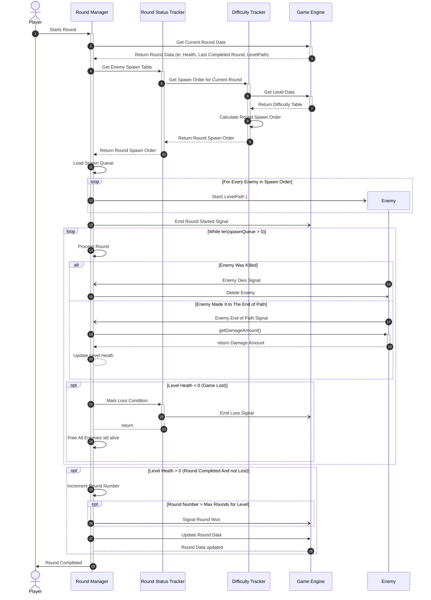

This Diagram can be regenerated on the cmd line using [mermaid-cli](https://github.com/mermaid-js/mermaid-cli)

```mermaid
sequenceDiagram
    autonumber
    actor player as Player

    participant RoundManager as Round Manager
    participant RoundStatusTracker as Round Status Tracker
    participant DifficultyTracker as Difficulty Tracker
    participant gameEngine as Game Engine
    player->>+RoundManager: Starts Round
    RoundManager->>+gameEngine: Get Current Round Data
    gameEngine-->>-RoundManager: Return Round Data (ie: Health, Last Completed Round, LevelPath)

    RoundManager->>+RoundStatusTracker: Get Enemy Spawn Table
    RoundStatusTracker->>+DifficultyTracker: Get Spawn Order for Current Round
    DifficultyTracker->>+gameEngine: Get Level Data
    gameEngine-->>-DifficultyTracker: Return Difficulty Table
    DifficultyTracker->>DifficultyTracker: Calculate Round Spawn Order
    DifficultyTracker-->>-RoundStatusTracker: Return Round Spawn Order
    RoundStatusTracker-->>-RoundManager: Return Round Spawn Order
    RoundManager->>RoundManager: Load Spawn Queue
    loop For Every Enemy in Spawn Order
        create participant Enemy
        RoundManager-)Enemy: Start( LevelPath )
    end

    RoundManager-)gameEngine: Emit Round Started Signal

    loop While len(spawnQueue > 0)
    
        RoundManager->>RoundManager: Process Round

        alt Enemy Was Killed
            Enemy-)RoundManager: Enemy Dies Signal
            RoundManager-xEnemy: Delete Enemy
        
        
        else Enemy Made It to The End of Path
            Enemy-)RoundManager: Enemy End of Path Signal
            RoundManager->>+Enemy: getDamageAmount()
            Enemy-->>-RoundManager: return Damage Amount
            RoundManager-->RoundManager: Update Level Heath
        end
        opt Level Heath < 0 (Game Lost)
            RoundManager->>+RoundStatusTracker: Mark Loss Condition
            RoundStatusTracker-)gameEngine: Emit Loss Signal
            RoundStatusTracker-->-RoundManager: return
            RoundManager->>RoundManager: Free All Enemies stil alive
        end
    end
    opt Level Heath > 0 (Round Completed And not Lost)
        RoundManager->>RoundManager: Increment Round Number
        opt Round Number > Max Rounds for Level
            RoundManager-)gameEngine: Signal Round Won
        end
        RoundManager->>gameEngine: Update Round Data
        gameEngine-->RoundManager: Round Data updated
    end

        RoundManager->>-player: Round Completed
    
            
            %% RoundManager->>+RoundStatusTracker: Mark Win Condition
            %% RoundStatusTracker--)gameEngine: Emit Win Signal
            %% RoundStatusTracker-->>-player: Return To Player
```